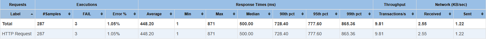
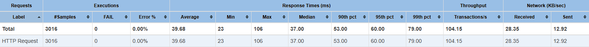
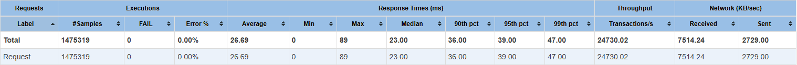

# URL Shortening Service

[](https://golang.org/)
[](https://www.postgresql.org/)
[](https://redis.io/)
[](https://kafka.apache.org/)
[](https://clickhouse.com/)
[](https://www.docker.com/)
[](/)

A high-performance URL shortening service built with Go, featuring real-time analytics, geolocation tracking, and horizontal scalability.

## 🚀 Features

- **URL Shortening** — Generate short, unique tokens using Base62 encoding
- **High-Performance Redirects** — Redis caching for fast URL lookups
- **Real-time Analytics** — Track clicks, geographic data, device types, and referrers
- **Geolocation** — IP-based location detection using GeoLite2 database
- **Event-Driven Architecture** — Kafka for async statistics processing
- **Dual Storage** — PostgreSQL for URL mappings, ClickHouse for analytics
- **Graceful Shutdown** — Proper cleanup of all connections and resources
- **Database Migrations** — Automatic schema management with Goose

## 🏗️ Architecture

```
┌─────────────┐     ┌─────────────┐     ┌─────────────┐
│   Client    │────▶│  HTTP API   │────▶│    Redis    │
└─────────────┘     └──────┬──────┘     │   (Cache)   │
                           │            └──────┬──────┘
                           │                   │
                           ▼                   ▼
                   ┌─────────────┐      ┌─────────────┐
                   │    Kafka    │      │  PostgreSQL │
                   │  (Events)   │      │  (Storage)  │
                   └──────┬──────┘      └─────────────┘
                          │
                          ▼
                   ┌─────────────┐     ┌─────────────┐
                   │  Consumer   │────▶│ ClickHouse  │
                   │ (Processor) │     │ (Analytics) │
                   └─────────────┘     └─────────────┘
```

### Key Design Decisions

- **Base62 Token Generation** — Efficient, URL-safe tokens from sequential IDs
- **Redis ID Generation** — Atomic counter with `INCR` for distributed environments
- **Cache-Aside Pattern** — Redis as a read-through cache for URL lookups
- **CQRS-like Pattern** — Separate read/write paths for statistics
- **Clean Architecture** — Domain, Application, and Infrastructure layers

## 📋 API Endpoints

| Method | Endpoint | Description |
|--------|----------|-------------|
| `POST` | `/shorten` | Create a shortened URL |
| `GET` | `/{token}` | Redirect to original URL |
| `PUT` | `/update/{token}` | Update original URL |
| `DELETE` | `/delete/{token}` | Delete URL mapping |
| `GET` | `/stats/{token}` | Get URL statistics |

### Examples

**Create Short URL:**
```bash
curl -X POST http://localhost:8080/shorten \
  -H "Content-Type: application/json" \
  -d '{"url": "https://example.com/very/long/url"}'
```

**Response:**
```json
{
  "id": 1,
  "original_url": "https://example.com/very/long/url",
  "url_token": "b",
  "created_at": "2025-12-23T12:00:00Z",
  "updated_at": "2025-12-23T12:00:00Z"
}
```

**Get Statistics:**
```bash
curl http://localhost:8080/stats/b
```

**Response:**
```json
{
  "url_token": "b",
  "total_clicks": 150,
  "unique_countries": {"United States": 80, "Germany": 40, "Japan": 30},
  "unique_cities": {"New York": 50, "Berlin": 40, "Tokyo": 30, "Other": 30},
  "device_types": {"Desktop": 100, "Mobile": 40, "Bot": 10},
  "referrer_stats": {"google.com": 60, "twitter.com": 40, "direct": 50}
}
```

## 🛠️ Tech Stack

| Component | Technology | Purpose |
|-----------|------------|---------|
| **Language** | Go 1.25 | Core application |
| **Web Server** | net/http | HTTP API |
| **Primary Storage** | PostgreSQL 16 | URL mappings |
| **Cache** | Redis | Fast lookups & ID generation |
| **Message Queue** | Kafka 3.9 | Async event processing |
| **Analytics DB** | ClickHouse | High-performance statistics |
| **Migrations** | Goose | Schema management |
| **Geolocation** | GeoLite2 | IP to location mapping |
| **Containerization** | Docker Compose | Local development |

## 🚦 Getting Started

### Prerequisites

- Docker & Docker Compose
- Go 1.25+ (for local development)
- Make (optional)

### Quick Start

1. **Clone the repository:**
```bash
git clone https://github.com/yourusername/url-shortening-service.git
cd url-shortening-service
```

2. **Start all services with Docker Compose:**
```bash
docker-compose --profile app up -d --build
```

Or using Make:
```bash
make build-app-up
```

3. **The service is now running at `http://localhost:8080`**

### Development Setup

1. **Start infrastructure only:**
```bash
docker-compose --profile infra up -d
# or
make infra-up
```

2. **Run the application locally:**
```bash
go run cmd/urlshorteningservice/main.go
```

### Environment Variables

| Variable | Default | Description |
|----------|---------|-------------|
| `SERVER_PORT` | 8080 | HTTP server port |
| `REDIS_URL` | localhost | Redis host |
| `REDIS_PORT` | 6379 | Redis port |
| `DB_HOST` | localhost | PostgreSQL host |
| `DB_PORT` | 5432 | PostgreSQL port |
| `DB_USER` | admin | PostgreSQL user |
| `DB_PASSWORD` | password | PostgreSQL password |
| `DB_NAME` | url_shortener_db | PostgreSQL database |
| `KAFKA_HOST` | localhost | Kafka host |
| `KAFKA_PORT` | 9094 | Kafka port |
| `CLICKHOUSE_HOST` | localhost | ClickHouse host |
| `CLICKHOUSE_PORT` | 9000 | ClickHouse port |
| `CLICKHOUSE_DB` | url_shortener_analytics | ClickHouse database |

## 🧪 Testing

The project has **80% test coverage** with unit tests for all business logic, handlers, and storage layers.

Run all tests with coverage:
```bash
make test
```

Or directly with Go:
```bash
go test -race -count=1 -coverprofile=coverage.out ./...
go tool cover -func=coverage.out
```

## 📊 Load Testing Results

### Statistics Endpoint (PostgreSQL)

<!-- TODO: Add screenshot -->


### Statistics Endpoint (ClickHouse)

<!-- TODO: Add screenshot -->


### Redirect Endpoint

<!-- TODO: Add screenshot -->


## 📁 Project Structure

```
├── cmd/
│   └── urlshorteningservice/
│       ├── main.go                 # Application entry point
│       ├── migrations/             # Embedded PostgreSQL migrations
│       └── clickhouse-migrations/  # Embedded ClickHouse migrations
├── internal/
│   ├── domain/                     # Domain models & interfaces
│   │   ├── mapping.go              # URL mapping entity
│   │   ├── statistics.go           # Statistics entities
│   │   ├── storage.go              # Storage interfaces
│   │   └── token_generator.go      # Base62 token generation
│   ├── application/                # Use cases / business logic
│   │   ├── urlcases/               # URL CRUD operations
│   │   └── stats/                  # Statistics processing
│   └── infrastructure/             # External dependencies
│       ├── http/                   # HTTP server & handlers
│       ├── database/               # PostgreSQL & ClickHouse
│       ├── redis/                  # Cache & ID generation
│       ├── kafka/                  # Event bus
│       └── location/               # GeoIP lookup
├── assets/
│   └── GeoLite2-City.mmdb          # GeoLite2 database
├── docker-compose.yml
├── Dockerfile
├── Makefile
└── go.mod
```

## 🔧 Make Commands

| Command | Description |
|---------|-------------|
| `make build-app-up` | Build and start all services |
| `make app-up` | Start all services (without rebuild) |
| `make infra-up` | Start infrastructure only |
| `make test` | Run tests with coverage |
| `make migrate-up` | Apply database migrations |
| `make migrate-down` | Rollback last migration |
| `make migrate-status` | Show migration status |

## 📝 License

This project is licensed under the MIT License - see the [LICENSE](LICENSE) file for details.

---

*Built as a portfolio project demonstrating Go, microservices architecture, and modern data engineering practices.*

