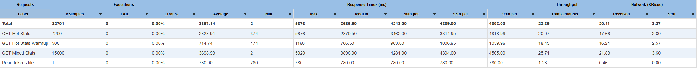
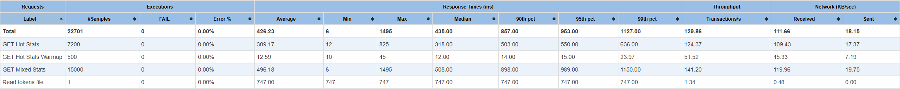
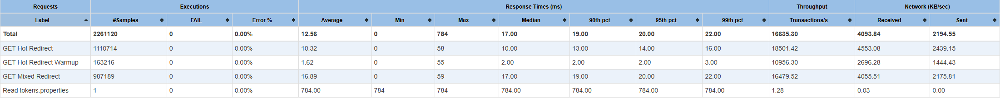
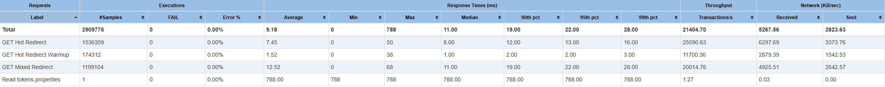

# URL Shortening Service

[](https://golang.org/)
[](https://www.postgresql.org/)
[](https://redis.io/)
[](https://kafka.apache.org/)
[](https://clickhouse.com/)
[](https://www.docker.com/)
[](https://github.com/Lexv0lk/url-shortening-service/actions)
[](/)

A high-performance URL shortening service built with Go, featuring real-time analytics, geolocation tracking, and horizontal scalability.

## 🚀 Features

- **URL Shortening** — Generate short, unique tokens using Base62 encoding
- **High-Performance Redirects** — Redis caching for fast URL lookups
- **Real-time Analytics** — Track clicks, geographic data, device types, and referrers
- **Geolocation** — IP-based location detection using GeoLite2 database
- **Event-Driven Architecture** — Kafka for async statistics processing
- **Dual Storage** — PostgreSQL for URL mappings, ClickHouse for analytics
- **Graceful Shutdown** — Proper cleanup of all connections and resources
- **Database Migrations** — Automatic schema management with Goose
- **CI/CD** — Automated testing and Docker validation with GitHub Actions

## 🏗️ Architecture

```
┌─────────────┐     ┌─────────────┐     ┌─────────────┐
│   Client    │────▶│  HTTP API   │────▶│    Redis    │
└─────────────┘     └──────┬──────┘     │   (Cache)   │
                           │            └──────┬──────┘
                           │                   │
                           ▼                   ▼
                   ┌─────────────┐      ┌─────────────┐
                   │    Kafka    │      │  PostgreSQL │
                   │  (Events)   │      │  (Storage)  │
                   └──────┬──────┘      └─────────────┘
                          │
                          ▼
                   ┌─────────────┐     ┌─────────────┐
                   │  Consumer   │────▶│ ClickHouse  │
                   │ (Processor) │     │ (Analytics) │
                   └─────────────┘     └─────────────┘
```

### Key Design Decisions

- **Base62 Token Generation** — Efficient, URL-safe tokens from sequential IDs
- **Redis ID Generation** — Atomic counter with `INCR` for distributed environments
- **Cache-Aside Pattern** — Redis as a read-through cache for URL lookups
- **CQRS-like Pattern** — Separate read/write paths for statistics
- **Clean Architecture** — Domain, Application, and Infrastructure layers

## 📋 API Endpoints

| Method | Endpoint | Description |
|--------|----------|-------------|
| `POST` | `/shorten` | Create a shortened URL |
| `GET` | `/{token}` | Redirect to original URL |
| `PUT` | `/update/{token}` | Update original URL |
| `DELETE` | `/delete/{token}` | Delete URL mapping |
| `GET` | `/stats/{token}` | Get URL statistics |

### Examples

**Create Short URL:**
```bash
curl -X POST http://localhost:8080/shorten \
  -H "Content-Type: application/json" \
  -d '{"url": "https://example.com/very/long/url"}'
```

**Response:**
```json
{
  "id": 1,
  "original_url": "https://example.com/very/long/url",
  "url_token": "b",
  "created_at": "2025-12-23T12:00:00Z",
  "updated_at": "2025-12-23T12:00:00Z"
}
```

**Get Statistics:**
```bash
curl http://localhost:8080/stats/b
```

**Response:**
```json
{
  "url_token": "b",
  "total_clicks": 150,
  "unique_countries": {"United States": 80, "Germany": 40, "Japan": 30},
  "unique_cities": {"New York": 50, "Berlin": 40, "Tokyo": 30, "Other": 30},
  "device_types": {"Desktop": 100, "Mobile": 40, "Bot": 10},
  "referrer_stats": {"google.com": 60, "twitter.com": 40, "direct": 50}
}
```

## 🚦 Getting Started

### Prerequisites

- Docker & Docker Compose
- Go 1.25+ (for local development)
- Make (optional)

### Quick Start

1. **Clone the repository:**
```bash
git clone https://github.com/yourusername/url-shortening-service.git
cd url-shortening-service
```

2. **Start all services with Docker Compose:**
```bash
docker-compose --profile app up -d --build
```

Or using Make:
```bash
make build-app-up
```

3. **The service is now running at `http://localhost:8080`**

## 🧪 Testing

The project has **80% test coverage** with unit tests for all business logic, handlers, and storage layers.

Run all tests with coverage:
```bash
make test
```

Or directly with Go:
```bash
go test -race -count=1 -coverprofile=coverage.out ./...
go tool cover -func=coverage.out
```

## 📊 Load Testing Results

### Statistics Endpoint — PostgreSQL vs ClickHouse

ClickHouse is optimized for analytical queries (column-oriented storage, vectorized execution), which gives a significant throughput boost over PostgreSQL for aggregation-heavy stats queries.

**PostgreSQL (baseline):**



**ClickHouse (analytics backend):**



### Redirect Endpoint — without Redis vs with Redis

Redis caching eliminates redundant PostgreSQL lookups for repeated short URL resolutions. Hot URLs are served directly from memory, drastically reducing latency and increasing RPS.

**No Redis (direct PostgreSQL lookup every request):**



**With Redis (cache-aside, hot paths served from memory):**



## 🔄 Continuous Integration

The project uses **GitHub Actions** for automated testing and validation:

### CI Pipeline Stages

1. **Test Stage**
   - Runs all unit tests with race detection
   - Generates test coverage report (80%+)
   - Uploads coverage HTML as artifact

2. **Docker Stage**
   - Validates `docker-compose.yml` configuration
   - Builds Docker images for all services
   - Starts services with health checks
   - Ensures all containers are healthy before deployment

### Workflow Triggers
- Push to `main` branch
- Pull requests to `main` branch

## 🔧 Make Commands

| Command | Description |
|---------|-------------|
| `make build-app-up` | Build and start all services |
| `make app-up` | Start all services (without rebuild) |
| `make infra-up` | Start infrastructure only |
| `make test` | Run tests with coverage |
| `make migrate-up` | Apply database migrations |
| `make migrate-down` | Rollback last migration |
| `make migrate-status` | Show migration status |

## 📝 License

This project is licensed under the MIT License - see the [LICENSE](LICENSE) file for details.

---

*Built as a portfolio project demonstrating Go, microservices architecture, and modern data engineering practices.*

